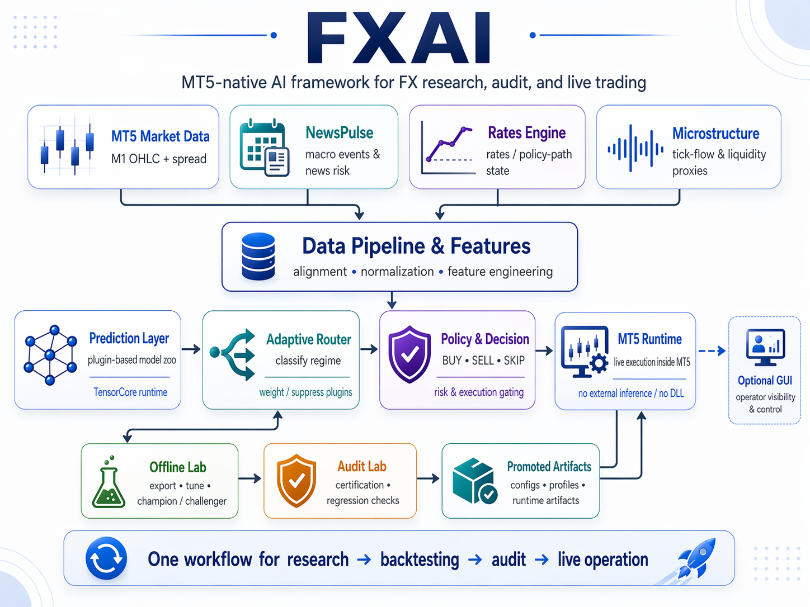

  

# FXAI Handbook

FXAI is a live-trading and research framework for FX. It combines a modular MT5 Expert Advisor, offline research and promotion workflows, shared runtime risk layers, and an optional macOS GUI so different users can work from the same source of truth without guessing what the system is doing.

## User Matrix

| User | Main Goal | Primary FXAI Value | Default Workspace |
|---|---|---|---|
| Live Trader | Observe and trust current live state | profile clarity, artifact health, runtime status, fast interpretation | Live Overview |
| Demo Trader | Observe behavior safely | compare runtime behavior vs audit expectation | Demo Overview |
| Backtester | Launch focused evaluations | quick run setup, scenario awareness, result comparison | Backtest Builder |
| EA Researcher | Improve models and promote better configs | plugin zoo, report browsing, offline lab workflows, lineage | Research Workspace |
| System Architect | Operate the research OS safely | governance, Turso health, recovery, operator dashboard | Platform Control |

## Why FXAI Is Useful By Role

- Live Trader: FXAI is not just a signal box. It shows whether the signal is safe to trust under current news, rates, microstructure, execution, and portfolio-conflict conditions.
- Demo Trader: FXAI lets you observe the full control plane in a low-risk setting so you can see when the system blocks, abstains, scales, or reroutes before capital is on the line.
- Backtester: FXAI makes it practical to compare run windows, settings, and scenarios without manually stitching together MT5 tests, reports, and runtime assumptions.
- EA Researcher: FXAI gives you a governed research loop from data export to candidate evaluation to promotion, with lineage and challenger control instead of ad hoc file copying.
- System Architect: FXAI exposes daemon health, runtime artifacts, services, recovery workflows, and research-state surfaces so platform problems can be found before they degrade trading quality.

## What You Can Do With FXAI

- Run the live EA with shared control-plane layers such as NewsPulse, Rates Engine, Cross Asset, Microstructure, Adaptive Router, Dynamic Ensemble, Probabilistic Calibration, Execution Quality, and Pair Network.
- Run Audit Lab to see how a strategy or promotion behaves in standard, walk-forward, macro-event, and hostile-market scenarios.
- Inspect the Model Zoo to understand which plugin families contribute regime, volatility, sequence, factor, trend, equilibrium, policy, and proxy-microstructure views.
- Use Offline Lab to export data, run campaigns, compare candidates, promote profiles, rebuild artifacts, and recover a clean runtime bundle.
- Use NewsPulse and related control-plane services to detect event risk, stale source conditions, policy divergence, liquidity stress, and pair-specific trading posture changes.
- Use the GUI as an operator shell for role-based workflows, runtime inspection, report browsing, recovery guidance, and command generation.

## Start Here

1. Read [Quick Start By Role](Quick%20Start%20By%20Role.md).
2. Read [Getting Started](Getting%20Started.md).
3. Go to the page that matches the job you want to do next:
   - [FXAI Framework](FXAI%20Framework.md)
   - [Data Policy](Data%20Policy.md)
   - [Project Structure](Project%20Structure.md)
   - [Benchmarks](Benchmarks.md)
   - [Model Zoo](Model%20Zoo.md)
   - [Promotion Criteria](Promotion%20Criteria.md)
   - [Release Notes](Release%20Notes.md)
   - [Audit Lab](Audit%20Lab.md)
   - [Offline Lab](Offline%20Lab.md)
   - [NewsPulse](NewsPulse.md)
   - [Rates Engine](Rates%20Engine.md)
   - [Cross Asset](Cross%20Asset.md)
   - [Microstructure](Microstructure.md)
   - [Adaptive Router](Adaptive%20Router.md)
   - [Dynamic Ensemble](Dynamic%20Ensemble.md)
   - [Probabilistic Calibration](Probabilistic%20Calibration.md)
   - [Execution Quality](Execution%20Quality.md)
   - [Label Engine](Label%20Engine.md)
   - [Drift Governance](Drift%20Governance.md)
   - [Pair Network](Pair%20Network.md)
   - [Runtime Control Plane](Runtime%20Control%20Plane.md)
   - [GUI](GUI.md)

## First-Day Scenarios

### Scenario: You are a live trader checking if EURUSD is safe to trust today

1. Open the latest runtime view in the GUI or inspect the live-state artifact.
2. Confirm NewsPulse, Rates Engine, Cross Asset, and Microstructure are fresh.
3. Check whether the pair is in `ALLOW`, `CAUTION`, `BLOCK`, or `ABSTAIN`.
4. Read the reasons, not only the score.
5. Only act if the system is healthy and the posture matches your session plan.

Why this matters:
- A strong model score can still be a bad trade when the execution-quality forecast is poor, the pair network says exposure is redundant, or the rates/news layers say the context is unstable.

### Scenario: You are a demo trader learning how the system behaves around events

1. Run NewsPulse and the rates engine.
2. Watch how the pair risk changes before and after a central-bank event.
3. Compare the runtime posture with the next Audit Lab or replay report.
4. Note which layer caused the trade to shrink, block, or abstain.

Why this matters:
- Demo is where you learn the difference between "the model predicted direction" and "FXAI decided the trade was actually executable."

### Scenario: You are a researcher trying to improve a weak promotion

1. Start in Offline Lab.
2. Compare the current champion with challenger families and recent drift state.
3. Review label quality, calibration, and execution-quality effects, not only headline accuracy.
4. Rebuild promotion artifacts and inspect the operator dashboard before trusting the candidate live.

Why this matters:
- FXAI is designed to improve the full decision stack, not only directional prediction.

## Operator Philosophy

- The terminal remains first-class.
- Generated artifacts are the source of truth for operator interpretation.
- Live safety layers should fail closed when the required state is unknown.
- The best FXAI workflow is role-based: live users inspect, researchers improve, architects recover, and everyone works from the same artifacts.
